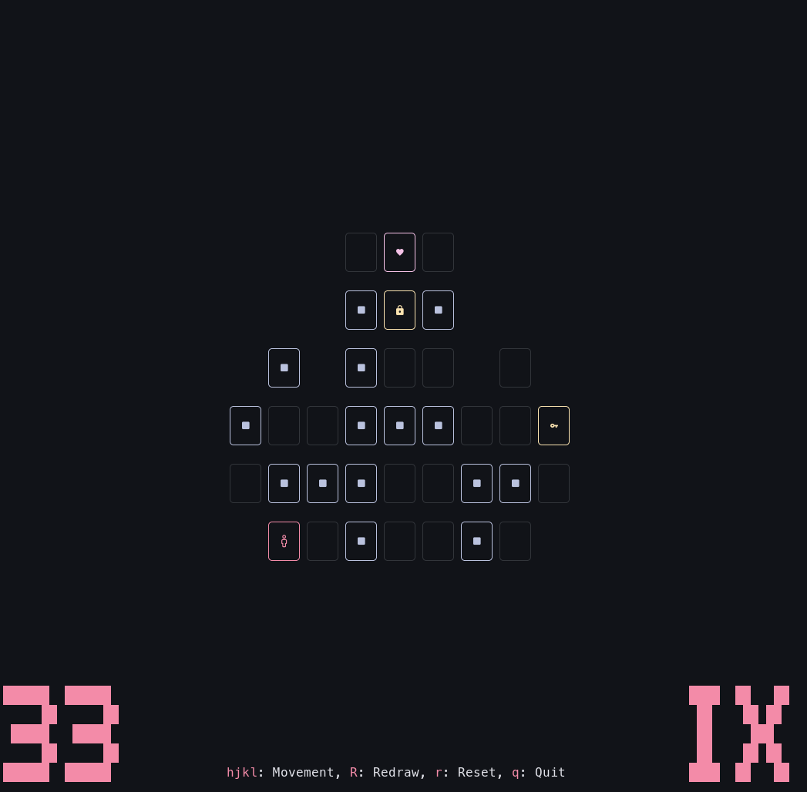

# Bashtaker
**bashtaker** is a terminal de-make of [Helltaker](https://store.steampowered.com/app/1289310/Helltaker/), written in Bash.
 

# How to play
## Clone the repository 
```sh
git clone https://github.com/EC2854/bashtaker && cd bashtaker
```
## Install dependencies
- `jq` (for map loading)
## Run the game
- Run the main script with a map file:
```sh
./bashtaker.sh maps/1.json
```
# Maps
Bashtaker includes the first 9 main levels from the original Helltaker game.
All map files are located in the `maps/` directory.
Each map is stored as a `.json` file.

# Why bash? 
Because it's funny :3
